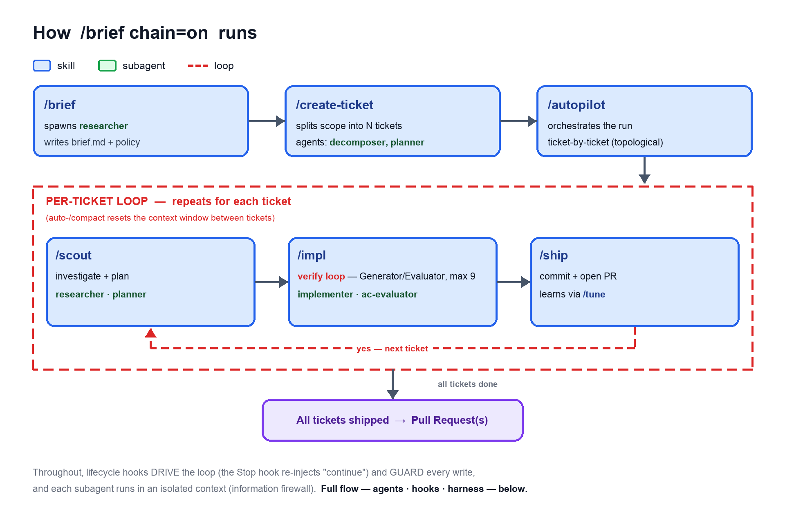
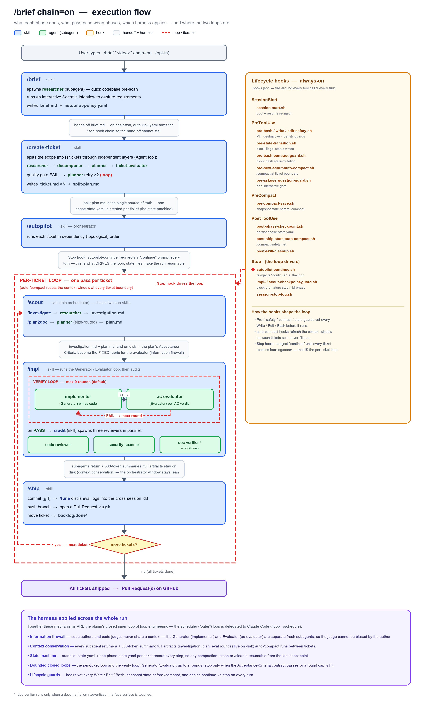

# simple-workflow

[](https://github.com/aimsise/simple-workflow/actions/workflows/ci.yml)
[](https://github.com/aimsise/simple-workflow/releases)
[](https://opensource.org/licenses/Apache-2.0)

The [Claude Code](https://docs.anthropic.com/en/docs/claude-code) plugin for **end-to-end AI development workflows**. From idea to pull request: structured interview, codebase investigation, multi-agent implementation, security audit, code review, and PR creation, all automated.

Built on a **Harness for long-running AI agents** that brings *loop engineering* to the development lifecycle — a rigorous, closed *inner loop* (act → verify → correct → continue) bounded by contract stopping conditions — with strict context management, information firewalls, and a cross-session knowledge base that improves accuracy with every completed ticket.

<p align="center">
  <picture>
    <source media="(prefers-color-scheme: dark)" srcset="docs/brief-chain-overview-dark.png">
    
  </picture>
  <br>
  <sub><i>The default <code>/brief chain=on</code> flow at a glance: skills (blue) drive subagents (green); the per-ticket loop and the in-<code>/impl</code> verify loop are red; lifecycle hooks drive and guard every step. The full flow — agents · hooks · harness — is in the collapsible below.</i></sub>
</p>

<details>
<summary><b>Full flow — every skill, agent, hook &amp; harness mechanism</b></summary>

<p align="center">
  <picture>
    <source media="(prefers-color-scheme: dark)" srcset="docs/brief-chain-flow-dark.png">
    
  </picture>
</p>

<sub>Regenerate: <code>python3 docs/gen-brief-chain-overview.py</code> · <code>python3 docs/gen-brief-chain-flow.py</code></sub>

</details>

## Prerequisites

- [Claude Code](https://docs.anthropic.com/en/docs/claude-code) CLI installed and authenticated
- [GitHub CLI](https://cli.github.com/) (`gh`) — required for pull-request creation
- `git` and `jq`

simple-workflow runs entirely against your local filesystem and your existing GitHub remote — no external services, no database, no separate auth.

## Quick Start

Claude Code resolves plugin names only against marketplaces that have already been registered, so installing `simple-workflow` is a two-step flow: register the repository as a marketplace, then install the plugin by name from it.

```bash
# Step 1 — register aimsise/simple-workflow as a marketplace
claude plugin marketplace add aimsise/simple-workflow

# Step 2 — install the simple-workflow plugin from that marketplace
claude plugin install simple-workflow@aimsise-simple-workflow
```

Inside an active Claude Code session, the equivalent slash commands are `/plugin marketplace add aimsise/simple-workflow` and `/plugin install simple-workflow@aimsise-simple-workflow`. The `aimsise-simple-workflow` suffix is the `name` declared in [`.claude-plugin/marketplace.json`](.claude-plugin/marketplace.json) and is what disambiguates the plugin when more than one marketplace is registered.

### Installation scope

`claude plugin install` writes to your **user scope** (`~/.claude/settings.json`) by default, making the plugin available across every project on your machine. To pin the plugin to a single repository so collaborators inherit it on clone, install at **project scope** instead:

```bash
claude plugin install simple-workflow@aimsise-simple-workflow --scope project
```

Project scope writes the marketplace and plugin entry to `<repo>/.claude/settings.json` — commit that file to share the configuration with your team. To migrate an existing user-scope install to project scope, uninstall first so the two entries do not coexist:

```bash
claude plugin uninstall simple-workflow@aimsise-simple-workflow --scope user
claude plugin install   simple-workflow@aimsise-simple-workflow --scope project
```

`--scope local` is also accepted; it writes to `<repo>/.claude/settings.local.json`, which is gitignored, so the plugin stays installed for you on this clone but does not propagate to collaborators. Slash-command forms (`/plugin install ... --scope project`, `/plugin uninstall ... --scope user`) work identically from within an active Claude Code session.

## Usage

Inside an active Claude Code session, type `/brief <idea>` and the plugin handles the rest end-to-end: codebase investigation, requirements interview, ticket creation, implementation, multi-agent review, and pull request.

Full argument signature: `/brief <what-to-build> [chain=on|off] [uc=on|off|metric-only] [parallel=on|off]` (default `chain=on`, `uc=on`, `parallel=on`). The `chain=on|off` form is canonical; `mode=auto|manual` is a deprecated legacy alias (`chain=on` ≡ `mode=auto`, `chain=off` ≡ `mode=manual`) — still accepted in v9.0.0 with a deprecation warning; slated for removal in a future major (deferred from v9.0.0). `/autopilot <slug>` accepts the same `[uc=on|off|metric-only] [parallel=on|off]` tokens.

**ultracode orchestration** is **on by default**: non-trivial (M+) tickets run their AC evaluation as a parallel multi-verifier panel via Claude Code's Workflow tool (forwarded `/brief` → `/autopilot` → each `/impl` and preserved across auto-`/compact`/resume; tier-appropriate model — Sonnet at `thorough`, Opus at `exhaustive`). Pass **`uc=off`** to revert to the byte-identical single-evaluator Agent path. Default-on applies under `chain=on` (the `/brief` default); under `chain=off` there is no chained `/autopilot`, so `uc` resolves `off`. Also accepted (as `uc=on|off|metric-only`) on `/autopilot <slug>` and `/impl …`. Details: `skills/impl/SKILL.md`.

**Wave-parallel ticket execution** is also **on by default** (v9.0.0): under `/autopilot` (and `/brief chain=on`) a multi-ticket run executes its `/scout`→`/impl`→`/ship` pipeline through one `ticket-executor` subagent per topologically-ready ticket / wave (each in an isolated git worktree, merged at wave boundaries), instead of the inline serial loop. Pass **`parallel=off`** to revert to the byte-identical v8.7.0 inline serial loop; the `SW_PARALLEL_TICKETS_MODE=off` / `SW_PARALLEL_HOOKS_MODE=off` environment kill switches force serial globally (the panic button when you cannot edit a `/brief`-chained invocation). A fat-fingered `parallel=<garbage>` value fails **safe to `off`** (the proven serial path), surfaced via `[PARALLEL-MODE] mode=off active=n reason=invocation-unknown-value-failsafe`. Default-on applies under `chain=on`; under `chain=off` there is no chained `/autopilot`, so `parallel` resolves `off`.

| Mode | Command | Result |
|------|---------|--------|
| Full automation (default, `chain=on`) | `/brief <idea>` | Idea → PR with zero intervention; large scopes are auto-split into multiple tickets and executed in dependency order |
| Brief-assisted manual (`chain=off`) | `/brief <idea> chain=off` | Structured brief and decision policy are produced; you drive each subsequent step (legacy alias: `mode=manual`) |
| Resume an interrupted run | `/autopilot <slug>` | Pick up where a previous automated run left off using state files under `.simple-workflow/backlog/` |

### Execution chains

Three typical execution patterns:

```text
# 1. Brief-assisted manual (type each command; repeat scout→impl→ship per ticket):
/brief <idea> chain=off
/create-ticket
/scout
/impl
/ship   # → PR

# 2. Brief manually, then switch to autopilot for the per-ticket loop:
/brief <idea> chain=off
# ...inspect the brief, then opt into autopilot: set `chain: on` in the brief file and
# re-run /create-ticket so each ticket dir receives autopilot-policy.yaml (re-propagation):
/create-ticket brief=.simple-workflow/backlog/briefs/active/<slug>/brief.md
/autopilot <slug>
# autopilot then loops: /scout → /impl → /ship per ticket → PR   ← loop engineering fires (the closed inner loop self-drives)
# (running /autopilot directly on a chain=off brief stops with a re-propagation directive)

# 3. Full automation (one command):
/brief <idea>
# brief chains: /create-ticket → /autopilot → (per ticket: /scout → /impl → /ship) → PR   ← loop engineering fires once /autopilot takes over
```

> **Caveat — full automation works best on focused, well-scoped ideas.** On overly broad or ambiguous input, the model can break output contracts, fabricate intermediate state, and continue past failures without surfacing them. Full automation has fewer human-in-the-loop checkpoints than the brief-assisted manual flow, so this kind of misbehaviour is easier to miss. For large or exploratory work, prefer `chain=off` (you inspect artifacts at each step) or split the work into smaller, focused briefs.

For phase-by-phase workflows on an existing backlog (skipping the brief), run `/help` inside Claude Code to discover the individual slash commands, or browse `skills/` in this repository.

Tickets carry a `### Capabilities` section that records which user Skills and MCP servers were available when the ticket was drafted and binds each runtime/visual acceptance criterion (live rendering, console-error count, keyboard focus/hover, WCAG contrast, network I/O, FS-state-dependent) to a concrete capability — so the downstream verifier (`/impl` -> `ac-evaluator`) picks evidence-gathering tools from the upstream-recorded mapping rather than re-deriving relevance per spawn.

## Why simple-workflow?

simple-workflow stands on three pillars — together they form the closed *inner loop* of *loop engineering* and the engineering around it that makes the loop trustworthy enough to run unattended:

- **Harness Engineering**: an asymmetric information firewall between code authors and code judges (the Generator-Evaluator pattern), ticket-confined artifacts, and safe-clear `[SW-CHECKPOINT]` markers are enforced *structurally* — by lifecycle hooks, fresh sub-agent contexts, and on-disk artifacts that hold regardless of model behavior. The bounded sub-agent return budget (< 500 tokens) is a *prompt-level contract* pinned by contract tests, not a runtime-truncation guarantee
- **Context Conservation**: the context window is treated as a consumable resource — sub-agents return < 500-token summaries, artifacts live on disk, and state survives compaction
- **Cross-session learning**: evaluation logs are distilled into reusable patterns that future implementations inject into their prompts, so the system gets better at your project the more tickets it completes

These pillars exist because Claude Code is powerful, but its context window is finite — and fragile. Long-running agent sessions face four structural threats:

| Threat | What happens | Structural countermeasure |
|--------|-------------|--------------------------|
| **Loss** | Session boundaries — compaction, exit — discard accumulated understanding | Automatic state snapshots, on-restart recovery, cross-session learning |
| **Exhaustion** | The window fills up, degrading instruction-following and response quality | Bounded sub-agent returns (< 500 tokens), phase-aware context release |
| **Contamination** | Biasing information leaks into contexts where it distorts judgment | Information firewall + ticket directory confinement (see [Harness Engineering](ARCHITECTURE.md#harness-engineering)) |
| **Bloat** | Unbounded intermediate output crowds out critical instructions | Artifacts written to files, structured summaries returned to orchestrator |

simple-workflow addresses the **structural** threats — Loss, Contamination, Bloat — with architectural constraints that hold regardless of model behavior: automatic snapshots, the information firewall + ticket confinement, and artifacts-to-disk. **Exhaustion** is mitigated by a mix of structural measures (fresh sub-agent contexts, phase-aware context release) and a prompt-level return-size contract (< 500 tokens) pinned by contract tests rather than enforced by runtime truncation. For a deeper walkthrough of each pillar — Context Conservation Protocol, Harness Engineering, Knowledge Base, and Ticket Management state machine — see [ARCHITECTURE.md](ARCHITECTURE.md).

## Setup & Configuration

The first time the plugin runs in a project, the target repository is prepared automatically: `git init -b main` if no repo exists (falls back to plain `git init` on git <2.28), an initial commit if HEAD is missing, and an idempotent append of `.simple-workflow/` to `.gitignore` (committed as `chore: add simple-workflow artifacts to .gitignore`). Once `.simple-workflow/.setup-done` is written, simple-workflow will **never** touch your `.gitignore` again — manual deletions are permanent.

### Sharing selected paths under `.simple-workflow/`

`.simple-workflow/` is gitignored by default, so the ticket counter (`.simple-workflow/.ticket-counter`) and every other artifact stay local — each developer starts independently at T-001. To share specific paths across a team (e.g. the counter for shared numbering, or project-wide spec docs), use the surgical opt-out below. The single-line `!.simple-workflow/.ticket-counter` does **not** work because git does not descend into an ignored parent directory; the structure must always be (1) un-ignore the directory, (2) re-ignore everything by default, (3) selectively un-ignore the path(s) you want tracked.

```gitignore
!.simple-workflow/                            # un-ignore the directory so git descends into it
.simple-workflow/*                            # re-ignore all contents by default
!.simple-workflow/.ticket-counter             # ...except the shared ticket counter
!.simple-workflow/docs/                       # ...and the docs/ directory
.simple-workflow/docs/*                       # re-ignore its contents
!.simple-workflow/docs/specs/                 # ...except specs/
!.simple-workflow/docs/specs/**               # ...including everything under specs/
```

Anything not explicitly un-ignored stays gitignored, so research notes, plans, eval logs, and the knowledge base remain private. Concurrent ticket creation by multiple developers will produce git conflicts on a shared counter — that is the expected trade-off. simple-workflow's behavior does not depend on whether files are tracked; these patterns are purely a per-team policy decision.

## Operational Notes

### Long idle gaps: start a new session before resuming

Claude Code's ephemeral prompt-cache entries have a roughly 1-hour TTL. If a session sits idle past that window — for example, an overnight pause — the next turn re-warms the cache from scratch and can rewrite **hundreds of thousands of cache_creation tokens** in a single turn.

**Recommendation**: if a simple-workflow session has been idle for more than ~1 hour, exit and start a fresh session. Phase-terminating workflows emit a `[SW-CHECKPOINT]` block precisely so that `/clear` or session exit is safe, and the plugin reconstructs the in-progress phase from `phase-state.yaml` on the next session.

### Resuming an interrupted automated run

If an automated run ends with a `partial` status before reaching the context-window cap, the model likely self-aborted before Claude Code's auto-Compaction had a chance to fire. Run `/autopilot <slug>` in a fresh session to pick up where it left off — state files in `.simple-workflow/backlog/` provide the resume point.

### Auto-`/compact` between autopilot tickets

Long-running `/autopilot` pipelines automatically run `/compact` at the **ticket boundary** so the conversation context does not fill up between tickets. `/compact` is injected via terminal-multiplexer keystroke from `hooks/pre-next-scout-auto-compact.sh` (primary) and `hooks/post-ship-state-auto-compact.sh` (safety net). After compaction `hooks/session-start.sh` re-injects `/autopilot <slug>` and the resume contract picks up the next ticket from `autopilot-state.yaml`.

- **Default**: ON inside an autopilot run, OFF outside.
- **Kill switch**: set `SW_AUTO_COMPACT_ON_SHIP_MODE=off` in your environment to disable (preserves the pre-v7 behaviour). `SW_AUTO_COMPACT_ON_SHIP_MODE=metric-only` logs the intent without injecting.

#### Terminal requirements for keystroke injection

`hooks/lib/inject-keys.sh` types `/compact` and the post-compact `/autopilot <slug>` back into the **originating** terminal surface — not whichever surface the user happens to focus when the hook fires. Support depends on what remote-control interface the host terminal exposes:

| Terminal | Supported | Notes |
|---|---|---|
| **tmux**, **GNU screen**, **WezTerm** | Yes | No extra setup |
| **kitty** | Yes | Requires `allow_remote_control yes` in `kitty.conf` |
| **iTerm2** | Single iTerm window only | Needs macOS Automation permission (`osascript` → iTerm). Multiple iTerm windows are unsolvable via AppleScript — refocus the originating window before each ticket boundary, or use tmux |
| Apple Terminal, Warp, Ghostty, Windows | No | Focus-leak risk (Apple Terminal) or no pane-targeted send-text CLI (others) |

**Recommendation: run `claude` inside tmux for any unattended autopilot run.** It is the only supported backend whose injection is provably correct under arbitrary focus changes during a multi-hour run, and it requires no OS configuration.

When injection cannot fire, the hook surfaces a one-line diagnostic via `inject_keys_failure_hint` as `additionalContext` in the next turn, and the autopilot continues — `/compact` is best-effort and never blocks `/scout` / `Edit` / `Write`.

## Limitations

- Designed for use with Claude Code CLI. IDE extensions (VS Code, JetBrains) may have limited support for hooks and plugin features.
- Pull-request creation requires GitHub CLI (`gh`) with authentication. Other Git hosting services are not supported.
- Ticket management uses the local filesystem (`.simple-workflow/backlog/`). There is no sync with external issue trackers (Jira, Linear, etc.).
- Sub-agents consume API tokens independently. The Generator (implementer) always runs on Opus, and the evaluator escalates to Opus for critical/exhaustive work, so larger or higher-risk tickets may incur higher API costs. By default (ultracode orchestration is on; pass `uc=off` to revert to the single-evaluator Agent path), M+ tickets additionally run a 3-lens parallel evaluator panel (Sonnet at `thorough`, Opus at `exhaustive`), further increasing token cost.
- Built-in test/lint detection covers JS, Python, Rust, Go, JVM (Gradle/Maven/sbt), .NET, Ruby, Elixir, Swift, Flutter/Dart, PHP, and Make. For other ecosystems, wrap your test/lint commands in a Makefile (`make test` / `make lint`) or the evaluator falls back to static code analysis only.
- Some recovery paths require interactive mode; running in `claude -p` or CI may stop with an explanatory message rather than complete the recovery.
- **Operating system support**: macOS and Linux are verified (the hook layer is `bash` + `jq`, with optional `yq` / `python3`). Windows is **not** verified — the `bash`+`jq` hook layer requires a POSIX environment (Git Bash, WSL, or Cygwin); native Windows is unsupported.
- **Global command blocks (installation footprint)**: a `v8.0.0` defense-in-depth `Bash` pre-hook unconditionally blocks four command classes in **every** project and session where the plugin is active — network egress (`curl`, `wget`, `scp`, `rsync … ssh`), identity spoofing (`git config user.email|user.name|core.hooksPath`), privilege escalation (`sudo`, `chmod 777`, `chown root`), and commit subversion (`git commit --amend`, `git stash drop`, `git reflog expire`, `git push … --no-verify`). A blocked command exits 2 with a `Blocked: … (v8.0.0 defense-in-depth)` message; there is currently no per-project opt-out knob. Installing the plugin at **project scope** rather than user scope confines these hooks (and all others) to a single repository.
- **Automatic git setup at session start**: under a user-scope install the `SessionStart` setup (see [Setup & Configuration](#setup--configuration)) runs in **any** working directory the session opens — so opening a non-project directory (e.g. `$HOME`) once will `git init` it and add an initial commit. Install at project scope to confine setup to one repository.

## Contributing

Contributions are welcome! Please see [CONTRIBUTING.md](CONTRIBUTING.md) for guidelines.

## License

[Apache License 2.0](LICENSE)
